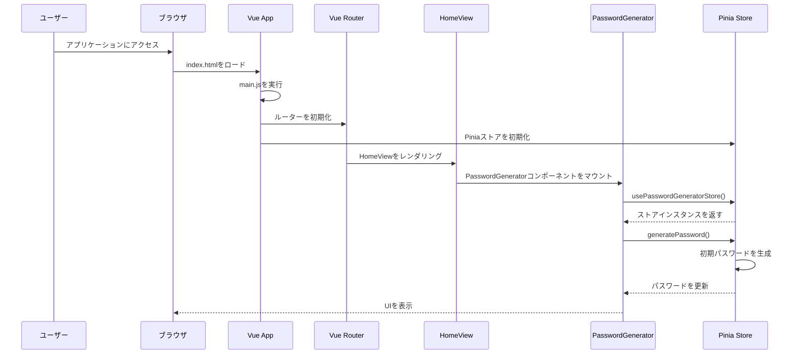
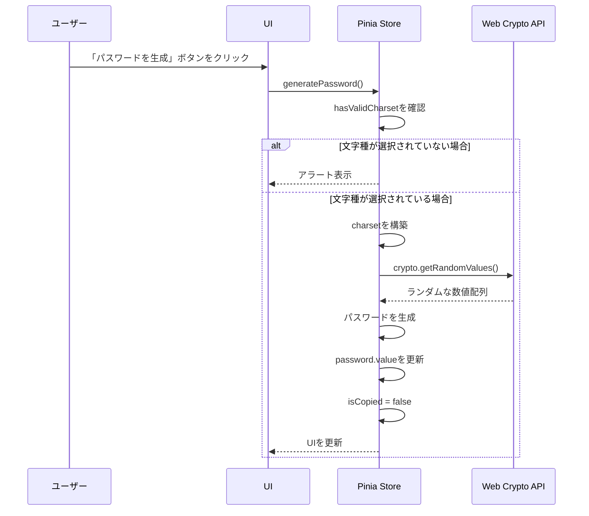
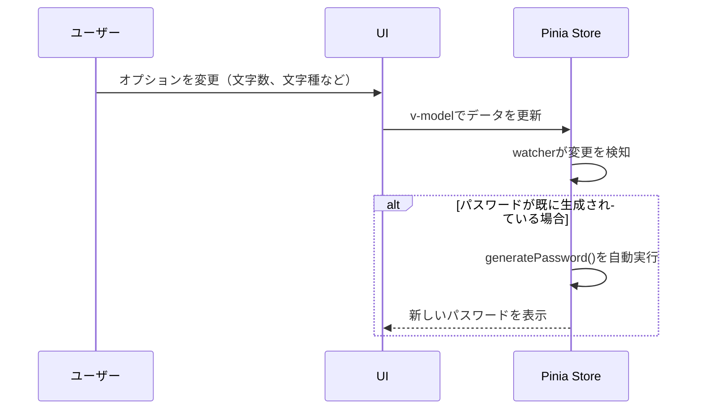
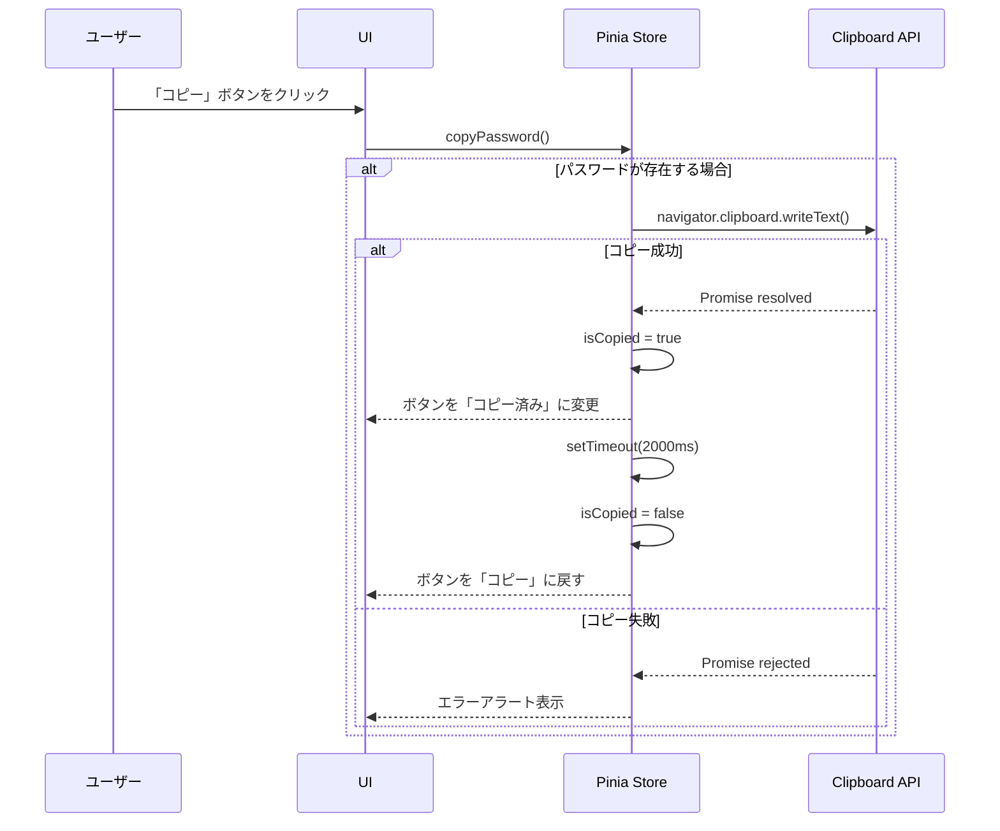
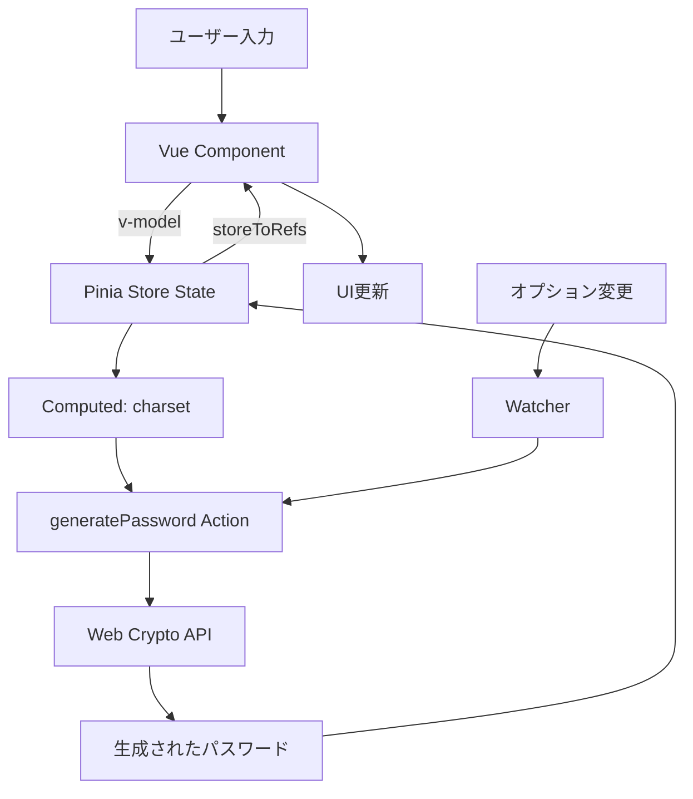

# パスワード生成アプリケーションのシーケンス図

## 概要

このドキュメントは、パスワード生成アプリケーションの処理フローをシーケンス図で説明します。

## 初期化処理

## パスワード生成処理

## オプション変更時の自動再生成

## コピー処理

## データフロー

## 状態管理

### Pinia Storeの状態

- **password**: 生成されたパスワード
- **length**: パスワードの文字数（4-32）
- **includeUppercase**: 大文字を含むか
- **includeLowercase**: 小文字を含むか
- **includeNumbers**: 数字を含むか
- **includeSymbols**: 記号を含むか
- **isCopied**: コピー済みフラグ

### 計算プロパティ

- **charset**: 選択された文字種から構築される文字セット
- **hasValidCharset**: 有効な文字セットが存在するか

### アクション

- **generatePassword**: パスワードを生成
- **copyPassword**: クリップボードにコピー

## セキュリティ考慮事項

1. **暗号学的に安全な乱数生成**: Web Crypto APIの`crypto.getRandomValues()`を使用
2. **クライアントサイド処理**: すべての処理はブラウザ内で完結し、サーバーへの送信なし
3. **データの非永続化**: 生成されたパスワードは保存されない